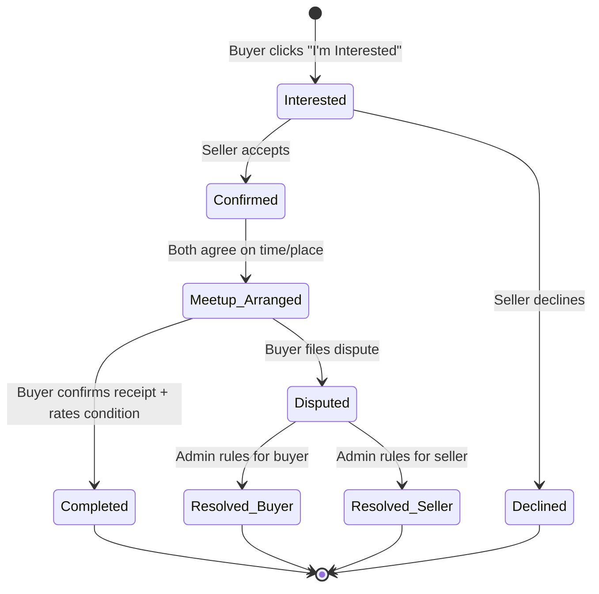
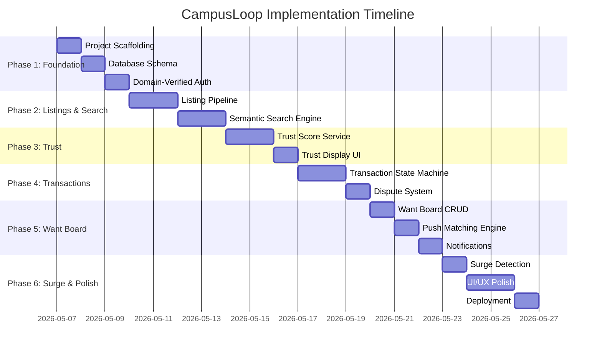

# CampusLoop — Phased Implementation Plan

A domain-scoped peer-to-peer marketplace for college students featuring multi-factor trust scoring, semantic search via text embeddings, demand-supply matching (want board), and semester-end surge detection.

---

## Tech Stack Summary

| Layer | Technology | Rationale |
|---|---|---|
| Frontend | **Next.js 14 (App Router)** | SSR, file-based routing, PWA support |
| Auth | **Supabase Auth** | Email OTP, domain allowlist, row-level security |
| Database | **PostgreSQL + pgvector** (Supabase) | Relational data + vector similarity search |
| Embeddings | **all-MiniLM-L6-v2** (sentence-transformers) | Lightweight, no GPU needed, 384-dim vectors |
| Backend API | **FastAPI (Python)** | Embedding generation, trust scoring, background jobs |
| Images | **Cloudinary** | Free tier, on-the-fly transforms, CDN |
| Background Jobs | **APScheduler** | Surge detection cron, want-board matching |
| Deploy | **Vercel** (frontend) + **Render** (API) | Free tier, live demo |

---

## Project Structure (Target)

```
CampusLoop/
├── frontend/                    # Next.js 14 App Router
│   ├── app/
│   │   ├── layout.tsx
│   │   ├── page.tsx             # Landing / homepage
│   │   ├── (auth)/
│   │   │   ├── login/page.tsx
│   │   │   └── verify/page.tsx
│   │   ├── listings/
│   │   │   ├── page.tsx         # Browse / search
│   │   │   ├── [id]/page.tsx    # Listing detail
│   │   │   └── new/page.tsx     # Create listing
│   │   ├── wants/
│   │   │   ├── page.tsx         # Want board
│   │   │   └── new/page.tsx     # Post a want
│   │   ├── transactions/
│   │   │   └── page.tsx         # My transactions
│   │   ├── profile/
│   │   │   └── [id]/page.tsx    # User profile + trust badge
│   │   └── admin/
│   │       └── disputes/page.tsx
│   ├── components/
│   ├── lib/
│   │   ├── supabase/
│   │   ├── api.ts               # FastAPI client
│   │   └── utils.ts
│   ├── public/
│   ├── next.config.js
│   └── package.json
│
├── backend/                     # FastAPI Python API
│   ├── app/
│   │   ├── main.py
│   │   ├── config.py
│   │   ├── models/
│   │   │   ├── listing.py
│   │   │   ├── user.py
│   │   │   ├── transaction.py
│   │   │   └── want.py
│   │   ├── routers/
│   │   │   ├── search.py
│   │   │   ├── trust.py
│   │   │   ├── wants.py
│   │   │   ├── surge.py
│   │   │   └── listings.py
│   │   ├── services/
│   │   │   ├── embedding.py     # sentence-transformers
│   │   │   ├── trust_score.py
│   │   │   ├── surge_detector.py
│   │   │   └── want_matcher.py
│   │   ├── jobs/
│   │   │   ├── scheduler.py     # APScheduler setup
│   │   │   ├── surge_cron.py
│   │   │   └── want_match_job.py
│   │   └── db/
│   │       ├── database.py
│   │       └── migrations/
│   ├── requirements.txt
│   └── Dockerfile
│
├── supabase/
│   └── migrations/              # SQL migrations
│       ├── 001_initial_schema.sql
│       ├── 002_pgvector.sql
│       ├── 003_trust_triggers.sql
│       └── 004_rls_policies.sql
│
├── .env.example
├── docker-compose.yml
└── README.md
```

---

## Phase 1 — Foundation & Auth (Days 1–3)

**Goal**: Project scaffolding, database schema, and domain-verified authentication.

### 1.1 Project Scaffolding

#### [NEW] `frontend/` — Next.js 14 App

- Initialize with `npx -y create-next-app@latest ./frontend --ts --app --eslint --src-dir --tailwind=false --import-alias="@/*"`
- Install dependencies: `@supabase/supabase-js`, `@supabase/ssr`
- Set up global CSS with design system (colors, typography, spacing)
- Configure environment variables (`.env.local`)

#### [NEW] `backend/` — FastAPI Python API

- Create virtual environment + `requirements.txt`
  - `fastapi`, `uvicorn`, `sqlalchemy`, `asyncpg`, `python-dotenv`, `supabase`, `sentence-transformers`, `apscheduler`, `cloudinary`, `pydantic`
- Scaffold `main.py` with CORS middleware, health check endpoint
- Set up `config.py` for environment variables

#### [NEW] `docker-compose.yml`

- Local PostgreSQL with pgvector extension
- Optional: local Supabase via `supabase/cli`

---

### 1.2 Database Schema

#### [NEW] `supabase/migrations/001_initial_schema.sql`

```sql
-- Core tables
CREATE TABLE users (
    id UUID PRIMARY KEY DEFAULT gen_random_uuid(),
    email TEXT UNIQUE NOT NULL,
    institution_domain TEXT NOT NULL,    -- extracted from email
    display_name TEXT,
    avatar_url TEXT,
    trust_score NUMERIC(4,2) DEFAULT 0.00,
    trust_badge TEXT DEFAULT 'New',      -- New / Verified / Trusted / Flagged
    account_created_at TIMESTAMPTZ DEFAULT now(),
    last_active_at TIMESTAMPTZ DEFAULT now()
);

CREATE TABLE listings (
    id UUID PRIMARY KEY DEFAULT gen_random_uuid(),
    seller_id UUID REFERENCES users(id),
    title TEXT NOT NULL,
    description TEXT,
    condition TEXT CHECK (condition IN ('Like New','Good','Fair','For Parts')),
    price NUMERIC(10,2) NOT NULL,
    category TEXT,
    image_urls TEXT[],                   -- Cloudinary URLs
    status TEXT DEFAULT 'active',        -- active / sold / expired
    institution_domain TEXT NOT NULL,    -- scoped visibility
    created_at TIMESTAMPTZ DEFAULT now(),
    updated_at TIMESTAMPTZ DEFAULT now()
);

CREATE TABLE transactions (
    id UUID PRIMARY KEY DEFAULT gen_random_uuid(),
    listing_id UUID REFERENCES listings(id),
    buyer_id UUID REFERENCES users(id),
    seller_id UUID REFERENCES users(id),
    status TEXT DEFAULT 'interested',    -- interested → confirmed → meetup → completed / disputed
    buyer_condition_rating TEXT,         -- buyer rates actual condition
    dispute_reason TEXT,
    created_at TIMESTAMPTZ DEFAULT now(),
    updated_at TIMESTAMPTZ DEFAULT now()
);

CREATE TABLE wants (
    id UUID PRIMARY KEY DEFAULT gen_random_uuid(),
    buyer_id UUID REFERENCES users(id),
    title TEXT NOT NULL,
    description TEXT,
    max_budget NUMERIC(10,2),
    institution_domain TEXT NOT NULL,
    status TEXT DEFAULT 'open',          -- open / fulfilled / expired
    expires_at TIMESTAMPTZ DEFAULT (now() + interval '30 days'),
    created_at TIMESTAMPTZ DEFAULT now()
);
```

#### [NEW] `supabase/migrations/002_pgvector.sql`

```sql
CREATE EXTENSION IF NOT EXISTS vector;

ALTER TABLE listings ADD COLUMN embedding vector(384);
ALTER TABLE wants ADD COLUMN embedding vector(384);

CREATE INDEX ON listings USING ivfflat (embedding vector_cosine_ops) WITH (lists = 100);
CREATE INDEX ON wants USING ivfflat (embedding vector_cosine_ops) WITH (lists = 50);
```

---

### 1.3 Domain-Verified Authentication

#### [NEW] `frontend/app/(auth)/login/page.tsx`

- Email input form — validates `.ac.in` / `.edu.in` / `.edu` domain client-side
- Calls Supabase `signInWithOtp({ email })` for magic link / OTP
- Displays institution name extracted from domain
- Error state for non-academic emails

#### [NEW] `frontend/app/(auth)/verify/page.tsx`

- OTP verification page
- On success: extract domain from email → store as `institution_domain` in `users` table
- Redirect to homepage

#### [NEW] `frontend/lib/supabase/client.ts` & `server.ts`

- Supabase browser client and server-side client utilities
- Middleware for protected routes

#### [NEW] `supabase/migrations/004_rls_policies.sql`

```sql
-- Listings visible only within same institution
ALTER TABLE listings ENABLE ROW LEVEL SECURITY;
CREATE POLICY "listings_same_campus" ON listings
    FOR SELECT USING (
        institution_domain = (SELECT institution_domain FROM users WHERE id = auth.uid())
    );

-- Users can only modify their own listings
CREATE POLICY "listings_owner_modify" ON listings
    FOR ALL USING (seller_id = auth.uid());
```

### Phase 1 — Verification

- [ ] User can sign up only with `.ac.in` / `.edu.in` / `.edu` emails
- [ ] OTP verification flow works end-to-end
- [ ] Non-academic emails are rejected with clear error
- [ ] User record created with correct `institution_domain`
- [ ] RLS policies enforce campus-scoped visibility
- [ ] Database schema matches ERD, pgvector extension active
- [ ] Frontend and backend health checks pass

---

## Phase 2 — Listing Pipeline & Semantic Search (Days 4–7)

**Goal**: Sellers can create listings with images, and buyers can search using natural language.

### 2.1 Listing Creation + Image Pipeline

#### [NEW] `frontend/app/listings/new/page.tsx`

- Multi-step listing form: photos → details → condition → price → preview → submit
- Image upload to Cloudinary (client-side unsigned upload preset)
- Condition grade selector: Like New / Good / Fair / For Parts
- Category selector with common campus categories (Electronics, Textbooks, Furniture, etc.)
- Auto-sets `institution_domain` from user's profile

#### [NEW] `backend/routers/listings.py`

- `POST /api/listings` — validates, stores listing, triggers embedding generation
- `GET /api/listings/{id}` — single listing detail
- `GET /api/listings` — paginated listing feed (filtered by institution_domain)
- `PATCH /api/listings/{id}` — update listing
- `DELETE /api/listings/{id}` — soft-delete (set status to expired)

#### [NEW] `backend/services/embedding.py`

```python
from sentence_transformers import SentenceTransformer

model = SentenceTransformer('all-MiniLM-L6-v2')

def generate_embedding(title: str, description: str, condition: str) -> list[float]:
    """Concatenate text fields → embed as single 384-dim vector."""
    text = f"{title}. {description}. Condition: {condition}"
    embedding = model.encode(text)
    return embedding.tolist()
```

- Model loaded once at startup (lazy singleton)
- Embedding generated on listing creation and update

### 2.2 Semantic Search Engine

#### [NEW] `backend/routers/search.py`

- `GET /api/search?q=...&institution=...`
  1. Embed the query string using same model
  2. Cosine similarity search against `listings.embedding` in pgvector
  3. Filter by `institution_domain` and `status = 'active'`
  4. Fallback to keyword `ILIKE` search for very short queries (< 3 words)
  5. Return ranked results with similarity scores

```sql
-- Core search query
SELECT *, 1 - (embedding <=> $1) AS similarity
FROM listings
WHERE institution_domain = $2 AND status = 'active'
ORDER BY embedding <=> $1
LIMIT 20;
```

#### [NEW] `frontend/app/listings/page.tsx`

- Search bar with debounced input (300ms)
- Category filter chips
- Sort options: Relevance / Price (Low-High) / Newest
- Listing cards grid with image, title, price, condition badge, seller trust badge
- Infinite scroll or pagination
- Empty state with suggestions

#### [NEW] `frontend/app/listings/[id]/page.tsx`

- Full listing detail page
- Image carousel
- Seller info card with trust badge + score breakdown
- "I'm Interested" button → initiates transaction
- Similar listings section (semantic similarity)

### Phase 2 — Verification

- [ ] Seller can create a listing with images uploaded to Cloudinary
- [ ] Embedding is generated and stored in pgvector on listing creation
- [ ] Semantic search: "something to study on" returns desks, chairs, monitors
- [ ] Keyword fallback works for very short queries
- [ ] Results are scoped to the user's campus
- [ ] Listing detail page renders correctly with seller info
- [ ] Search performance < 500ms for typical queries

---

## Phase 3 — Trust Scoring Engine (Days 8–10)

**Goal**: Every seller has a transparent, multi-factor trust score that updates on every transaction event.

### 3.1 Trust Score Computation

#### [NEW] `backend/services/trust_score.py`

```python
def compute_trust_score(user_id: str) -> dict:
    """
    Score = weighted sum of:
      - completion_rate       (0.35) — completed / total transactions
      - condition_accuracy    (0.25) — listed condition matches buyer rating
      - response_time_score   (0.15) — avg time to respond to interest
      - dispute_penalty       (0.15) — deduction per unresolved dispute
      - account_age_bonus     (0.10) — longevity bonus, capped
    
    Score decays on inactivity (no transactions in 60 days → gradual decay).
    
    Returns: {
        score: 0.00–5.00,
        badge: "New" | "Verified" | "Trusted" | "Flagged",
        breakdown: { ... component scores ... }
    }
    """
```

**Badge thresholds**:
| Badge | Score Range | Criteria |
|---|---|---|
| Flagged | < 1.5 | Multiple disputes, low completion |
| New | 0.0 (default) | No completed transactions yet |
| Verified | 2.0 – 3.9 | ≥ 3 completed transactions, score ≥ 2.0 |
| Trusted | 4.0 – 5.0 | ≥ 10 completed transactions, score ≥ 4.0 |

#### [NEW] `supabase/migrations/003_trust_triggers.sql`

```sql
-- Trigger: recompute trust on every transaction state change
CREATE OR REPLACE FUNCTION notify_trust_recompute()
RETURNS TRIGGER AS $$
BEGIN
    PERFORM pg_notify('trust_recompute', NEW.seller_id::text);
    RETURN NEW;
END;
$$ LANGUAGE plpgsql;

CREATE TRIGGER trg_transaction_trust
AFTER INSERT OR UPDATE ON transactions
FOR EACH ROW EXECUTE FUNCTION notify_trust_recompute();
```

#### [NEW] `backend/routers/trust.py`

- `GET /api/trust/{user_id}` — returns score + breakdown + badge
- `POST /api/trust/recompute/{user_id}` — internal endpoint, triggered by DB notification
- Listens to PostgreSQL `NOTIFY` channel for real-time recomputation

### 3.2 Trust Display on Frontend

#### [NEW] `frontend/components/TrustBadge.tsx`

- Visual badge component (color-coded: green=Trusted, blue=Verified, gray=New, red=Flagged)
- Expandable breakdown showing each factor's contribution
- Tooltip on hover explaining what each factor means

#### [NEW] `frontend/app/profile/[id]/page.tsx`

- User profile page with trust score prominently displayed
- Transaction history summary
- Listing history
- Member since / last active

### Phase 3 — Verification

- [ ] Trust score computed correctly with all 5 weighted factors
- [ ] Score updates automatically on transaction state change
- [ ] Badge assignments match threshold criteria
- [ ] Score decays after 60 days of inactivity
- [ ] Trust breakdown visible on profile page
- [ ] Trust badge appears on listing cards and detail pages
- [ ] Edge cases: new user (score=0, badge=New), disputed user (badge=Flagged)

---

## Phase 4 — Transaction System & Disputes (Days 11–13)

**Goal**: Full transaction lifecycle from interest → meetup → completion, with a dispute resolution path.

### 4.1 Transaction State Machine



#### [NEW] `backend/routers/transactions.py`

- `POST /api/transactions` — buyer expresses interest (creates `interested` state)
- `PATCH /api/transactions/{id}/confirm` — seller confirms
- `PATCH /api/transactions/{id}/meetup` — meetup details (location, time)
- `PATCH /api/transactions/{id}/complete` — buyer confirms receipt + condition rating
- `POST /api/transactions/{id}/dispute` — buyer opens dispute with reason
- Each state transition logged with timestamp for audit trail

### 4.2 Dispute Resolution

#### [NEW] `frontend/app/admin/disputes/page.tsx`

- Admin view of all open disputes
- Dispute detail: listing info, buyer/seller details, chat history, dispute reason
- Admin resolution: rule for buyer or seller
- Resolution outcome feeds into seller's trust score

#### [NEW] `frontend/app/transactions/page.tsx`

- "My Transactions" dashboard
- Tabs: Buying / Selling
- Status indicators with state machine visualization
- Action buttons contextual to current state
- In-app messaging between buyer and seller (simple, stored in DB)

### Phase 4 — Verification

- [ ] Full transaction flow works: interested → confirmed → meetup → completed
- [ ] Seller can decline interest
- [ ] Buyer can rate condition accuracy on completion
- [ ] Dispute flow: buyer opens dispute → admin resolves → outcome affects trust
- [ ] Every state transition is logged with timestamp
- [ ] Listing status changes to "sold" on completion
- [ ] Transaction dashboard shows correct state for both buyer and seller

---

## Phase 5 — Want Board & Demand Matching (Days 14–16)

**Goal**: Buyers post what they need; the system matches new listings against open wants automatically.

### 5.1 Want Board

#### [NEW] `frontend/app/wants/new/page.tsx`

- Form: title, description, max budget (optional)
- Auto-sets `institution_domain` from user profile
- Want expires after 30 days or when manually fulfilled

#### [NEW] `frontend/app/wants/page.tsx`

- Browse open wants within your campus
- If you have the item → button to create a listing (pre-fills from want)
- Filter by category, budget range

#### [NEW] `backend/routers/wants.py`

- `POST /api/wants` — create want + generate embedding
- `GET /api/wants` — list open wants (campus-scoped)
- `PATCH /api/wants/{id}/fulfill` — mark as fulfilled
- `DELETE /api/wants/{id}` — remove want

### 5.2 Push Matching Engine

#### [NEW] `backend/services/want_matcher.py`

```python
async def match_listing_to_wants(listing_id: str):
    """
    On every new listing:
    1. Get listing embedding
    2. Cosine similarity search against all open wants in same institution
    3. If similarity > 0.75 threshold → notify the want poster
    4. Include listing link + similarity reason in notification
    """
```

#### [NEW] `backend/jobs/want_match_job.py`

- Triggered on every new listing creation (synchronous, not cron)
- Also: nightly job to expire wants older than 30 days

#### Notification System

- In-app notifications table:
  ```sql
  CREATE TABLE notifications (
      id UUID PRIMARY KEY DEFAULT gen_random_uuid(),
      user_id UUID REFERENCES users(id),
      type TEXT,           -- 'want_match', 'transaction_update', 'surge_alert'
      title TEXT,
      message TEXT,
      link TEXT,
      read BOOLEAN DEFAULT false,
      created_at TIMESTAMPTZ DEFAULT now()
  );
  ```
- Frontend notification bell with unread count
- Optional: email notification via Supabase Edge Functions or SendGrid

### Phase 5 — Verification

- [ ] Buyer can post a want with title, description, budget
- [ ] Want board shows campus-scoped wants
- [ ] When a new listing matches an open want (similarity > 0.75), buyer is notified
- [ ] Want auto-expires after 30 days
- [ ] Seller can create listing pre-filled from a want
- [ ] Notification bell shows unread count and links to relevant pages

---

## Phase 6 — Surge Detection & Polish (Days 17–20)

**Goal**: Detect graduation/semester-end listing spikes, activate surge mode, and polish the full experience.

### 6.1 Surge Detection Layer

#### [NEW] `backend/services/surge_detector.py`

```python
async def check_surge(institution_domain: str) -> dict:
    """
    1. Count listings created today for this institution
    2. Compare against 7-day rolling average
    3. If today > 2× average → SURGE MODE activated
    
    Returns: {
        is_surge: bool,
        today_count: int,
        avg_count: float,
        similar_items_today: [{ category, count }]
    }
    """
```

#### [NEW] `backend/jobs/surge_cron.py`

- Runs every 6 hours via APScheduler
- Computes surge status per institution
- Stores result in `surge_status` table for frontend consumption

#### [NEW] Surge Mode Frontend Features

- **Homepage banner**: "📈 Surge detected! X items listed today — semester ending?"
- **Listing form nudge**: "X similar items listed today — price competitively" with median price suggestion
- **Dedicated surge feed**: `/listings?surge=true` — time-sorted, countdown to semester end
- **Pricing suggestion**: based on median price of similar items in current surge

### 6.2 UI/UX Polish

#### Landing Page (`frontend/app/page.tsx`)

- Hero section with campus illustration and value prop
- "How it works" 3-step flow
- Featured listings carousel
- Trust score explainer section
- CTA to sign up

#### Global Components

- `Navbar` — logo, search bar, notifications bell, profile avatar
- `Footer` — links, about, contact
- `ListingCard` — image, title, price, condition badge, trust badge
- `SearchBar` — debounced semantic search with recent searches
- `NotificationBell` — dropdown with unread notifications
- `EmptyState` — illustrated empty states for all pages

#### Responsive & PWA

- Mobile-first responsive design
- PWA manifest + service worker for installability
- Offline listing drafts (localStorage)

### 6.3 Deployment

| Component | Platform | Config |
|---|---|---|
| Frontend | **Vercel** | Connect GitHub repo, auto-deploy `main` |
| Backend API | **Render** | Docker deploy, free web service |
| Database | **Supabase** | Free tier PostgreSQL + pgvector |
| Images | **Cloudinary** | Free tier (25GB storage, 25GB bandwidth) |

- Environment variables configured on each platform
- CI/CD via GitHub Actions: lint, type-check, test on PR

### Phase 6 — Verification

- [ ] Surge detection correctly identifies when daily listings > 2× rolling average
- [ ] Surge banner appears on homepage during surge
- [ ] Pricing suggestions shown on listing form during surge
- [ ] Landing page looks polished and premium
- [ ] All pages responsive on mobile
- [ ] PWA installable on mobile browsers
- [ ] Deployed and accessible on public URLs
- [ ] End-to-end flow: signup → list item → search → transact → rate → trust updates

---

## Timeline Summary



---

## Open Questions

> [!IMPORTANT]
> **1. Supabase project**: Do you already have a Supabase project created, or should I set one up as part of Phase 1?

> [!IMPORTANT]
> **2. Cloudinary account**: Do you have a Cloudinary account/API keys ready, or should we use a placeholder image service for initial development?

> [!NOTE]
> **3. Email domains**: Should we hardcode a list of known Indian college domains (`.ac.in`, `.edu.in`), or accept any `.edu` domain globally? Should there be an admin flow to add new domains?

> [!NOTE]
> **4. Messaging**: The transaction flow mentions "meetup arranged" — do you want a simple in-app chat between buyer and seller, or just a text field for meetup details (location/time)?

> [!NOTE]
> **5. Admin role**: How should admin users be designated? Hardcoded list of emails, or a role in the database that existing admins can assign?

> [!NOTE]
> **6. Cross-campus mode**: The spec mentions this as a stretch feature. Should we design the schema to support it from day 1 (toggle flag) but not build the UI yet?
